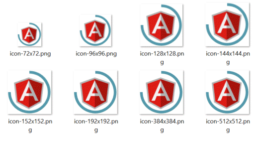

# ngx-pwa-icons



Automatic icon generator for Angular 6+ with PWA.    
Create an icon in the root folder of your Angular project and use `ngx-pwa-icons` to automatically resize and replace the original PWA icons.

### Installing globally

Installation via `npm`: 
    
- On Windows  

```bash
$ npm install -g ngx-pwa-icons
```  

- On Mac

```bash
$ sudo npm install -g ngx-pwa-icons
```

This will install `ngx-pwa-icons` globally so that it may be run from the command line.

### Usage

Add PWA capabilities to an existing Angular 6+ app.

    $ ng add @angular/pwa

Create an `icon.png` file in the root folder of your Angular project. 

Then run:
```bash
$ ngx-pwa-icons
```

For good results, your `icon.png` file should be:

- square
- transparant background
- at least 512*512px

### Available Options:

`-h` or `--help` Show help   
`-v` or `--version` Show package version number   
`-d` or `--dry-run` Run through without making any changes  
`-i` or `--icon` Original icon to convert (defaults to **"./icon.png"**)   
`-o` or `--output` Output folder  (defaults to **"./src/assets/icons"**)   
`-s` or `--size` Resize icons to px  (defaults to **"512, 384, 192, 152, 144, 128, 96, 72"**)   
`-n` or `--name` Icon name.   
Replaces wildcard character * with icons size  (defaults to **"icon-\*x\*.png"**)  
Eg: `ngx-pwa-icons -s "100,200,300" -n "icon_*_*.png"` generates **icon_100_100.png**, **icon_200_200.png** and **icon_300_300.png**, 